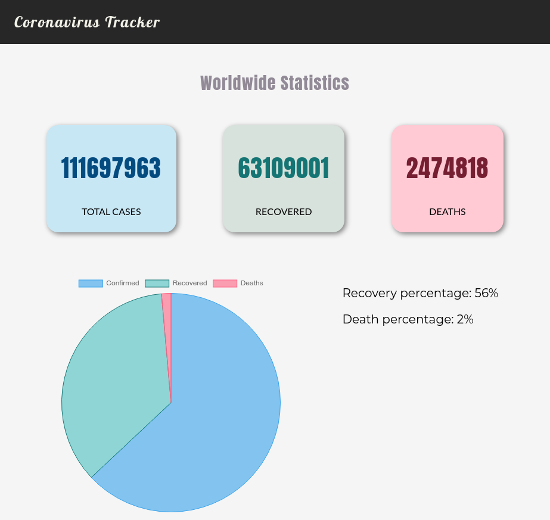
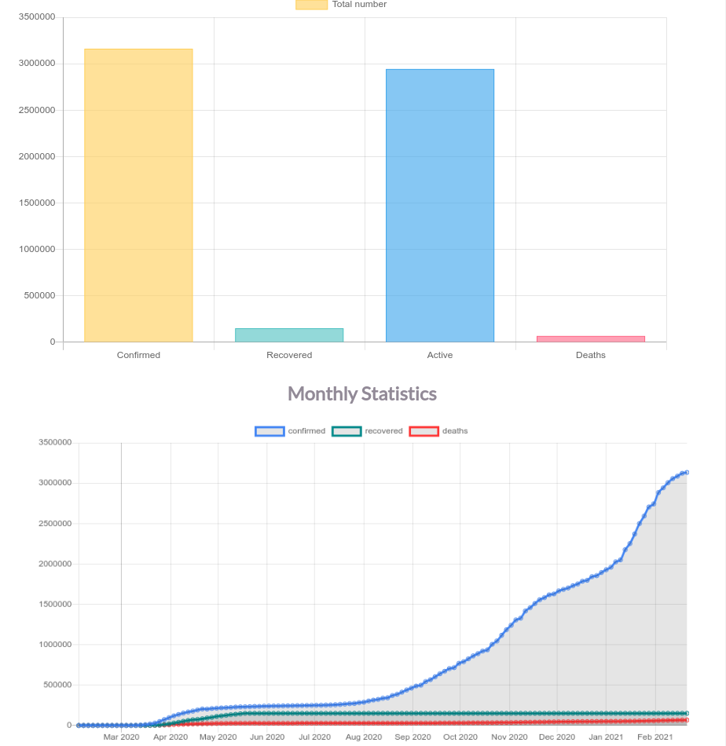
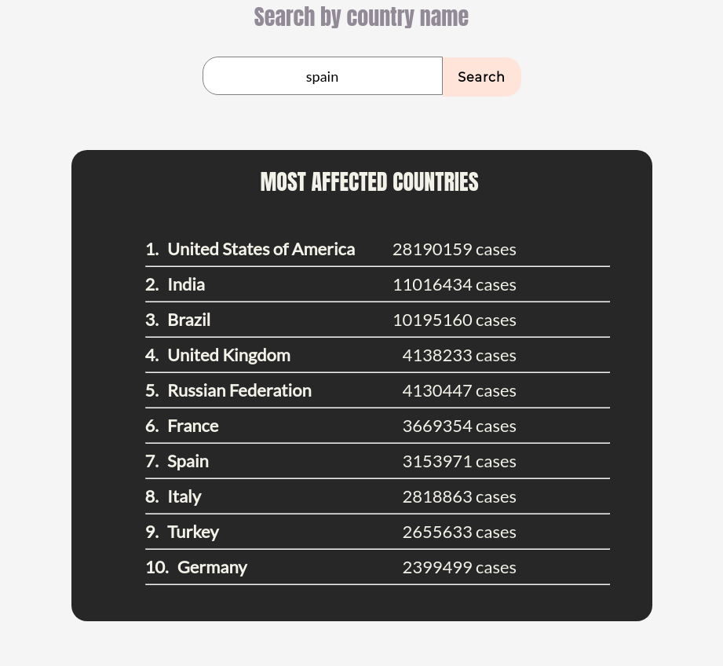

# Covid-tracker
A COVID-19 tracker using python-flask

## Dependencies:
### Windows: 
```
pip install flask
```  
### Linux/Mac:
```
sudo apt install python3-flask
```  
## Run locally:
```
python3 main.py
```

### Snapshots:



